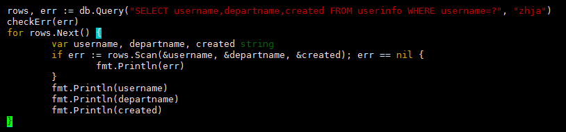

# 坑

## 报错：【golang】安装库出错 cannot find package “github.com/xxx“ in any of

**1. 去手动获取引用**    
参考链接：https://blog.csdn.net/sphinx1122/article/details/117395530
**2. 配置问题**

首先执行`go env`查看配置,看是否打开go mod开关和设置代理，没有的话执行以下代码。
```go
go env -w GO111MODULE=on
go env -w GOPROXY=https://goproxy.cn,direct

// macOS或Linux
export GO111MODULE=on
export GOPROXY=https://goproxy.cn
```

***

## go mod 使用
https://zhuanlan.zhihu.com/p/482014524

## golang 使用Viper读取yaml配置文件中的数据

1. config.yaml文件

```yaml
db:
  username: root
  password: 1234
  host: 127.0.0.1
  port: 3306
  dbname: jystest
```

2. viperHelper.go

    引用`"github.com/spf13/viper"`
   
```go
func ViperHelper() *viper.Viper{
	//获取项目的执行路径
	path, err := os.Getwd()
	if err != nil {
		panic(err)
	}

	config := viper.New()

	config.AddConfigPath(path)     //设置读取的文件路径
	config.SetConfigName("config") //设置读取的文件名
	config.SetConfigType("yaml")   //设置文件的类型
	//尝试进行配置读取
	if err := config.ReadInConfig(); err != nil {
		panic(err)
	}
	return config
}
```

3. 使用，比如在初始化mysql
数据库的时候需要读取yaml文件

    initDB.go

```go
var DB *sql.DB

func InitDB() *sql.DB {
	Config:=ViperHelper()
	username:=fmt.Sprintf("%v",Config.Get("db.username"))
	password:=fmt.Sprintf("%v",Config.Get("db.password"))
	host:=fmt.Sprintf("%v",Config.Get("db.host"))
	port:=fmt.Sprintf("%v",Config.Get("db.port"))
	dbname:=fmt.Sprintf("%v",Config.Get("db.dbname"))

	connectionString := strings.Join([]string{username, ":", password, "@tcp(", host, ":", port, ")/", dbname, "?charset=utf8"+"&parseTime=true"}, "")
	fmt.Println(connectionString)
	DB, _ = sql.Open("mysql", connectionString)
	DB.SetConnMaxLifetime(10)
	DB.SetMaxIdleConns(5)
	if err := DB.Ping(); err != nil {
		fmt.Println("opon database fail")
		return nil
	}
	fmt.Println("connnect success")
	return DB
}
```
***
## 报错：go mod vender package io/fs is not in GOROOT (/usr/local/go/src/io/fs)

**升级go版本到1.16+，再执行go mod vender**
***
## 报错：Go语言win10出现：CreateProcess error=216 xxx的问题exec %1 xxx. xxx file does not exist.

**解决办法：请注意，go中main为程序入库，该main函数必须在main包中，才可以执行**

如果修改了package为main包之后，还是没有解决，那么将你的 .idea 文件删除，然后重启一下goland，并重新选择go sdk，然后再运行该程序，如果还是没有解决，依然报这个问题

执行`go env`

GOARCH=amd64 GOARCH 表示目标处理器架构。

GOOS=windows GOOS 表示目标操作系统。

CGO_ENABLED=0 CGO_ENABLED交叉编译 1.开启 0.关闭

如果不是以下配置则执行：

```go
go env -w GOARCH=amd64
go env -w GOOS=windows
go env -w CGO_ENABLED=0
```

参考链接：https://blog.csdn.net/weixin_48536164/article/details/126866878

***

## go语言interface{}类型转换

**假设val是interface类型**

**1. interface{}转[]interface{}**

```go

val.([]interface{})
```

**1. interface{}转string**
```go
str:=fmt.Sprintf("%v",val)
```

***

## go操作数据库 Go-SQL-Driver/MySQL 使用详解

项目中用到的是`"github.com/jinzhu/gorm/dialects/mysql"`来操作数据库，看过源码后找到操作数据使用的是Go-SQL-Driver/MySQL，所以这里略过安装和配置的写法。可以参考：https://www.cnblogs.com/zhja/p/5604553.html

1. 增删改
基本使用方法：先预处理，再加入参数执行。

2. 查单条，QueryEow

3. 查多条


***

## Go 如何获取一定范围内的随机数

1. go语言未提供获取指定区间范围内的随机数方法，只有一个参数获取（0， n）的随机数。

2. 可根据此方法获取指定区间随机数，先随机0到(m-n)，再用加 n 的方式解决

例：[5, 10], 先生成[0,5], 再加5

```go
package main
 
import (
	"fmt"
	"math/rand"
	"time"
)
 
func main() {
	// 由于go语言未提供2个区间参数，只一个参数的情况下先随机0到(m-n)，再用加 n 的方式解决
	// 例：[5, 10], 先生成[0,5], 再加5
 
	// go取随机数需要指定一个随机种子
	// 种子一般使用当前的系统时间，这是完全随机的。
 
	for i := 0; i < 50; i++ {
		// res := getRandomWithAll(5, 10)
		// res := getRandomWithMin(5, 10)
		// res := getRandomWithMax(5, 10)
		res := getRandomWithNo(5, 10)
		fmt.Println(res)
	}
 
}
 
// 包含上下限 [min, max]
func getRandomWithAll(min, max int) int64 {
	rand.Seed(time.Now().UnixNano())
	return int64(rand.Intn(max-min+1) + min)
}
 
// 不包含上限 [min, max)
func getRandomWithMin(min, max int) int64 {
	rand.Seed(time.Now().UnixNano())
	return int64(rand.Intn(max-min) + min)
}
 
// 不包含下限 (min, max]
func getRandomWithMax(min, max int) int64 {
	var res int64
	rand.Seed(time.Now().UnixNano())
Restart:
	res = int64(rand.Intn(max-min+1) + min)
	if res == int64(min) {
		goto Restart
	}
	return res
}
 
// 都不包含 (min, max)
func getRandomWithNo(min, max int) int64 {
	var res int64
	rand.Seed(time.Now().UnixNano())
Restart:
	res = int64(rand.Intn(max-min) + min)
	if res == int64(min) {
		goto Restart
	}
	return res
}
```