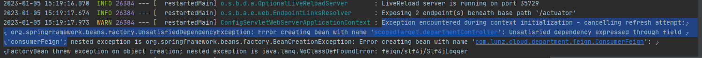
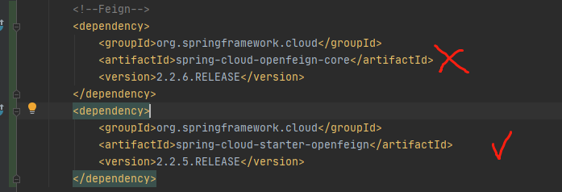
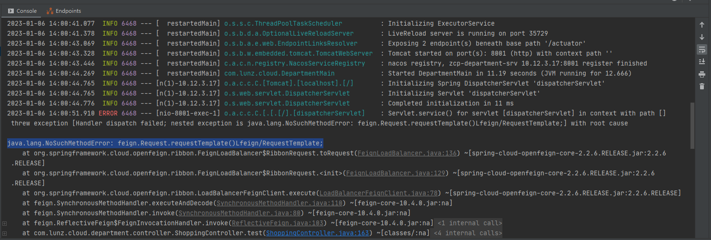
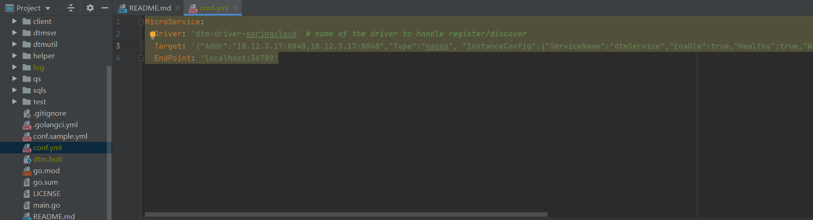
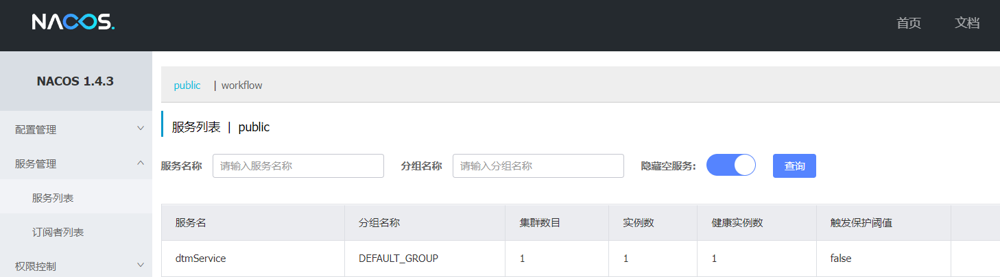
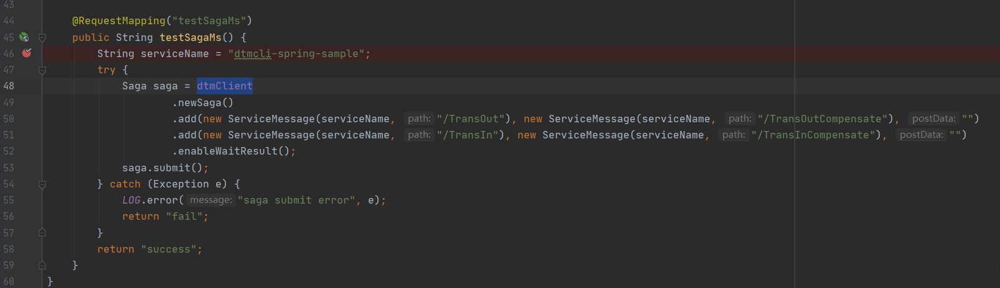
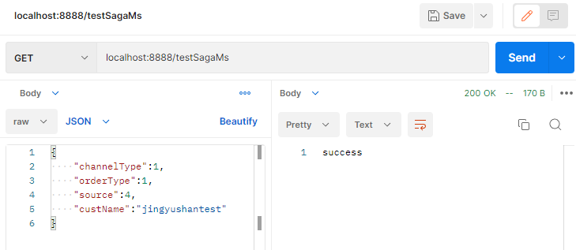
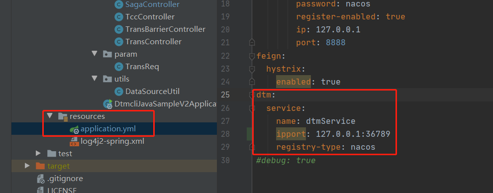

# dtm

## 安装dtm

1. 启动dtm报错sf.IsExported undefined (type reflect.StructField has no field or method IsExported)
   
解决办法：更新go版本至1.17

2. 在golang里添加go版本的时候报错：**The selected directory is not a valid home for Go SDK**

解决办法：直接在文件里改sdk版本并重启
参考链接：https://blog.csdn.net/qq_26979105/article/details/122677749

***

## dtm启动

1. springCloud接入dtm时要根据项目中springboot的版本选择jar包版本


我的springboot版本是2.2.2_RELEASE, 使用的是dtmcli-java 2.1.6

2. demo启动报错


修改DtmClient注入方式，直接将endPoint地址直接加入DtmClient。


3. 无法验证补偿机制
将某一步骤设置为失败时触发


1. 启动报错
   
报错：

**SLF4J: Failed toString() invocation on an object of type** [com.alibaba.nacos.client.naming.beat.BeatInfo]

**java.lang.NoClassDefFoundError: com/alibaba/fastjson/JSON**

原因：因为使用了fastjson解析json，但没有引用jar包。
解决办法： 

```
<dependency>
    <groupId>com.alibaba</groupId>
    <artifactId>fastjson</artifactId>
    <version>1.2.83</version>
</dependency>
```

5. 报错内容如下

解决办法：

6. feign-httpclient依赖版本的不匹配导致的报异常，需要feign-core和feign-httpclient版本对应，也是因为jar包用的不对。


7. source code does not match the bytecode
Source code does not match the bytecode（源代码与字节码不匹配）
解决办法：重启项目

## 使用message的方式

### 一、demo README.md
1. 下载github.com/dtm-labs/dtm
2. 新建一个conf.yml文件，内容为：
```
MicroService:
  Driver: 'dtm-driver-springcloud' # name of the driver to handle register/discover
  Target: '{"Addr":"127.0.0.1:8848,127.0.0.1:8848","Type":"nacos", "InstanceConfig":{"ServiceName":"dtmService","Enable":true,"Healthy":true,"Weight":10},"ClientConfig":{"NamespaceId":"c3dc917d-906a-429d-90a9-85012b41014e","UserName":"nacos","Password":"nacos","NotLoadCacheAtStart":true}}'
  EndPoint: 'localhost:36789'
```


3. 启动语句
   ```
   go run main.go -c conf.yml
   ```
启动成功：


此时demo里的localhost:8001/testSagaMs成功：



### 二、项目中的配置
1. demo里对于dtm的配置文件在application.yml

但是我们的demo配置文件在nacos上配的，所以需要加一个作为dtm的配置**dtm-conf.properties**

**内容对应上图**
```
dtm.service.registryType=nacos
dtm.ipport:10.12.3.17:36789
dtm.name: dtmService
```

2. 修改DtmClient注册方式
   ```
   Saga saga = new DtmClient()
   ```

3. message和http不能混用，但可以都用message的方式