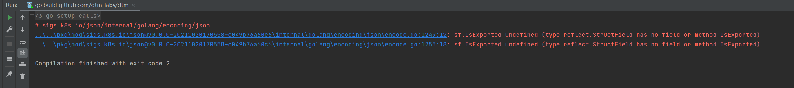
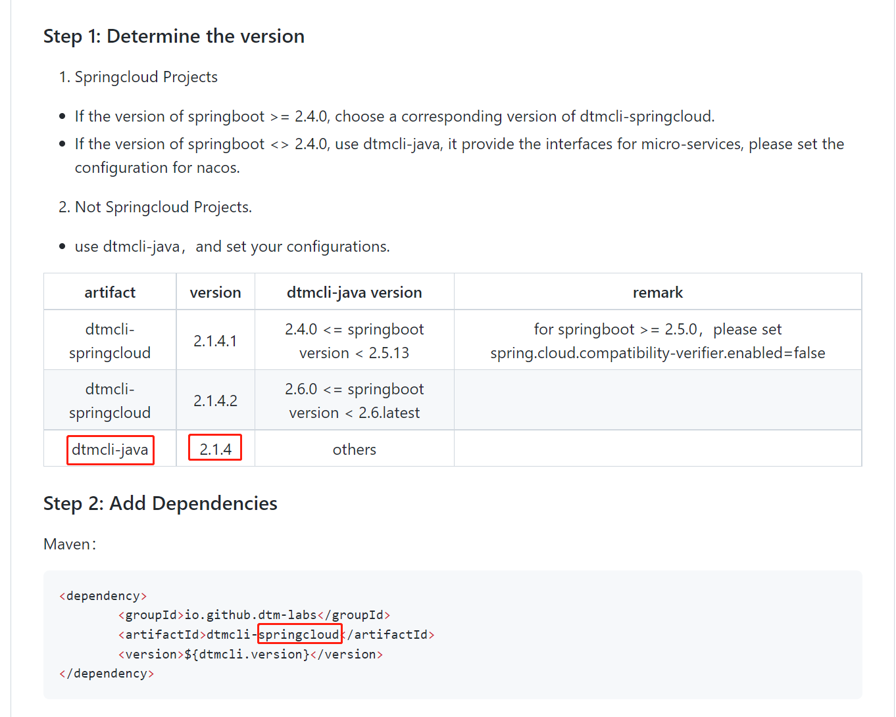
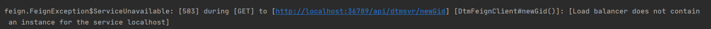
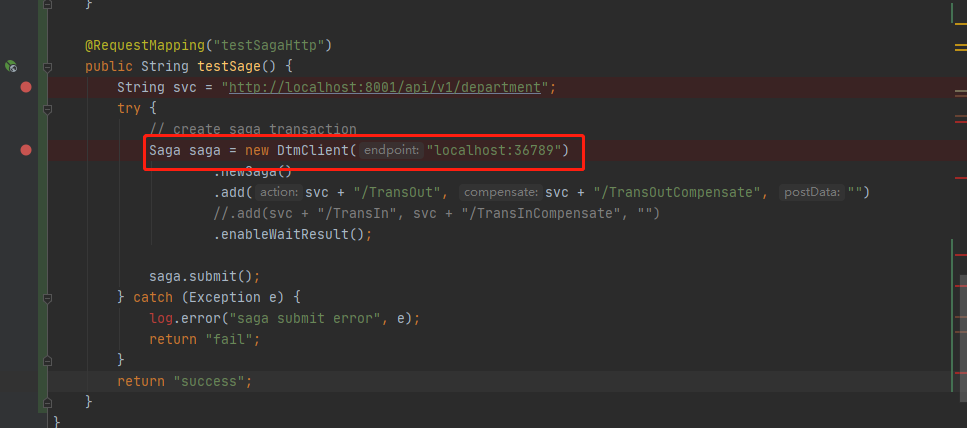
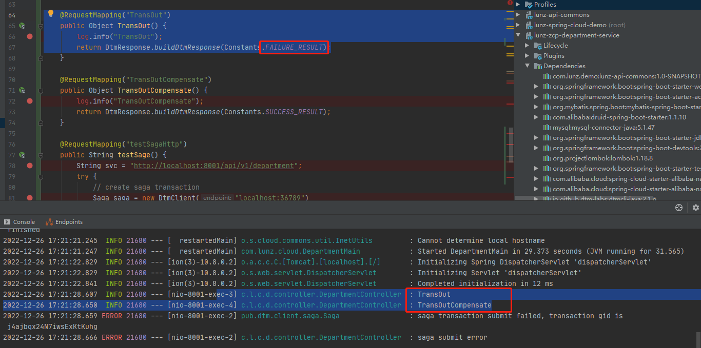

# dtm

## 安装dtm

1. 启动dtm报错sf.IsExported undefined (type reflect.StructField has no field or method IsExported)
   
解决办法：更新go版本至1.17

2. 在golang里添加go版本的时候报错：**The selected directory is not a valid home for Go SDK**

解决办法：直接在文件里改sdk版本并重启
参考链接：https://blog.csdn.net/qq_26979105/article/details/122677749

***

## 使用dtm

1. springCloud接入dtm时要根据项目中springboot的版本选择jar包版本

我的springboot版本是2.2.2_RELEASE, 使用的是dtmcli-java 2.1.6

2. demo启动报错

修改DtmClient注入方式，直接将endPoint地址直接加入DtmClient。


3. 无法验证补偿机制
将某一步骤设置为失败时触发


4. 启动报错
   
报错：

**SLF4J: Failed toString() invocation on an object of type** [com.alibaba.nacos.client.naming.beat.BeatInfo]

**java.lang.NoClassDefFoundError: com/alibaba/fastjson/JSON**

原因：因为使用了fastjson解析json，但没有引用jar包。
解决办法： 

```
<dependency>
    <groupId>com.alibaba</groupId>
    <artifactId>fastjson</artifactId>
    <version>1.2.83</version>
</dependency>
```