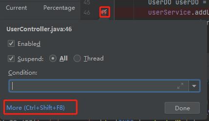

# 踩坑合集

## Method breakpoints may dramatically slow down debugging

启动debug模式准备调试程序，但是在IDEA上点击debug按钮后却一直无法正常启动项目，但run模式是可以正常启动的，同样的代码在另一台电脑上debug也没有问题。

启动debug模式的时候发现有一行字`Method breakpoints may dramatically slow down debugging`

参考链接：[Method breakpoints may dramatically slow down debugging 解决]

**右键点断点红点处，点more进入BreakPoints。**

**去掉Java Method BreakPoints处的对号。**

**重新debug，正常启动。**

另外查了一下BreakPoints的解释：[断点Breakpoints解释]

****

## IDEA项目结构出现 0% methods,0% lines covered

[IDEA项目结构出现 0% methods,0% lines covered]

解决上述问题，只需要使用快捷键 Ctrl + Alt + F6，在弹出窗口中取消项目前面的√, 点击show selected

****

[断点Breakpoints解释]:[https://blog.csdn.net/qq_39416311/article/details/100859160]

[Method breakpoints may dramatically slow down debugging 解决]:[https://blog.csdn.net/weixin_38084097/article/details/111310067]

[IDEA项目结构出现 0% methods,0% lines covered]:[https://blog.csdn.net/qq_38132901/article/details/83789145][IDEA项目结构出现 0% methods,0% lines covered]:[https://blog.csdn.net/qq_38132901/article/details/83789145][IDEA项目结构出现 0% methods,0% lines covered]:[https://blog.csdn.net/qq_38132901/article/details/83789145][IDEA项目结构出现 0% methods,0% lines covered]:[https://blog.csdn.net/qq_38132901/article/details/83789145]
# Java

##  环境配置问题
https://blog.csdn.net/weixin_66598341/article/details/126510900
