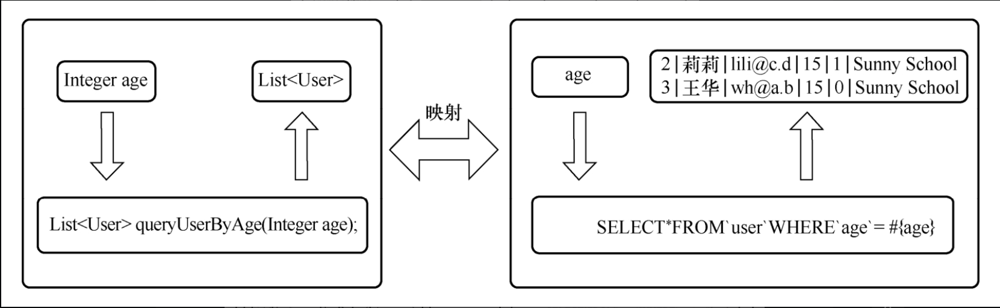
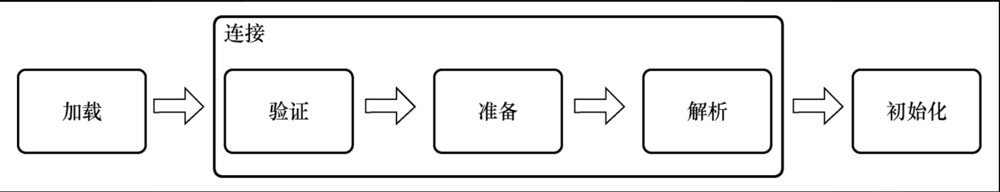
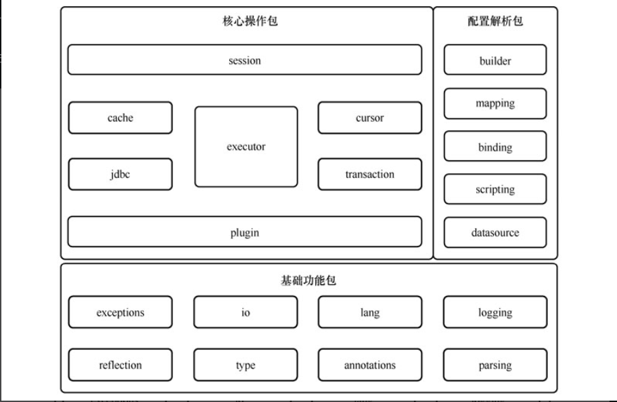
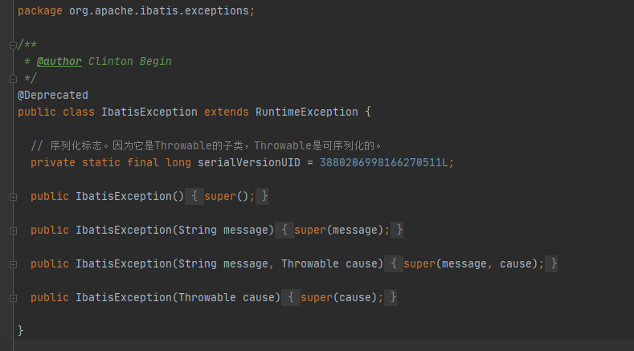

# 《Mybatis源码详解》

## 项目结构
第一篇：背景介绍(chp1-4)  
第二篇：基础功能包源码阅读(chp5-11)  
第三篇：配置解析包源码阅读(chp12-17)  
第四篇：核心操作包源码阅读(chp18-24)  
第五篇：总结(chp25-26)  

***
### chp1-3
* 源码阅读技巧：调试追踪、归类总结、上下文整合；  
* 源码阅读策略：找出软件项目的核心功能，重点关注与核心功能相关的代码。
* Mybatis是一种ORM(Object Relation Mapping, 对象关系映射)框架； 
* Mybatis没用采用普遍的用一组对应关系将对象和数据绑定在一起，而是将Java方法和sql语句关联起来；Mybatis还挺国内管理一种映射机制将SQL语句的参数或结果与对象关联起来。
  
* **Mybatis核心功能：**
  * 将包含 if等标签的复杂数据库操作语句解析为纯粹的 SQL语句。
  * 将数据库操作节点和映射接口中的抽象方法进行绑定，在抽象方法被调用时执行数据库操作。
  * 将输入参数对象转化为数据库操作语句中的参数。
  * 将数据库操作语句的返回结果转化为对象。
* **MyBatis的操作主要分为两大阶段：**
  * 第一阶段：MyBatis初始化阶段。该阶段用来完成 MyBatis运行环境的准备工作，只在 MyBatis启动时运行一次。
    * 类的加载就是 Java虚拟机将描述类的数据从 Class文件加载到 JVM的过程。
        
  * 第二阶段：数据读写阶段。该阶段由数据读写操作触发，将根据要求完成具体的增、删、改、查等数据库操作。
    *  建立连接数据库的 SqlSession。
    *  查找当前映射接口中抽象方法对应的数据库操作节点，根据该节点生成接口的实现。
    *  接口的实现拦截对映射接口中抽象方法的调用，并将其转化为数据查询操作。
    *  对数据库操作节点中的数据库操作语句进行多次处理，最终得到标准的 SQL语句。
    *  尝试从缓存中查找操作结果，如果找到则返回；如果找不到则继续从数据库中查询。
    *  从数据库中查询结果。
    *  处理结果集。
       *  建立输出对象；
       *  根据输出结果对输出对象的属性赋值。
    * 在缓存中记录查询结果。
    * 返回查询结果。

***

### chp4  MyBatis源码结构
1. 包的分类

在“src\main\java\org.apache.ibatis”目录下可以看到 MyBatis 项目的所有包，共 20个。可以分为三类：
* **基础功能包**：这些包用来为其他包提供一些外围基础功能，如文件读取功能、反射操作功能等。这些包的特点是功能相对独立，与业务逻辑耦合小。
  * 其中包括：-exceptions-reflection-annotations-lang-type-io-logging-parsing
* **配置解析包**：这些包用来完成配置解析、存储等工作。这些包中的方法主要在系统初始化阶段运行。
  * 其中包括：-binding-builder-mapping-scripting-datasource
* **核心操作包**：这些包用来完成数据库操作。在工作过程中，这些包可能会依赖基础功能包提供的基础功能和配置解析包提供的配置信息。这些包中的方法主要在数据库操作阶段运行。
  * 其中包括：-jdbc-cache-transaction-cursor-executor-session-plugin

***
### chp5 exceptions包
  “异常”代表程序运行中遇到了意料之外的事情，为了表征异常，Java标准库中内建了一些通用的异常，这些类以 Throwable为父类。而 Throwable又派生出 Error类和 Exception类两大子类。

Throwable及其子类类图：

* 遇到@Deprecated注解标注的类，我们可以直接略去。  
    exception包里的IbatisException方法有该标志  
    
* Exception类的每个类都有四种构造方法：
  * 无参构造方法；
  * 传入错误信息字符串的构造方法；
  * 传入上级 Throwable实例的构造方法；
  * 传入上级 Throwable实例和错误信息字符串的构造方法。

**ExceptionFactory类的wrapException方法，它用来生成并返回一个RuntimeException对象。**

***

### chp6 reflect包
