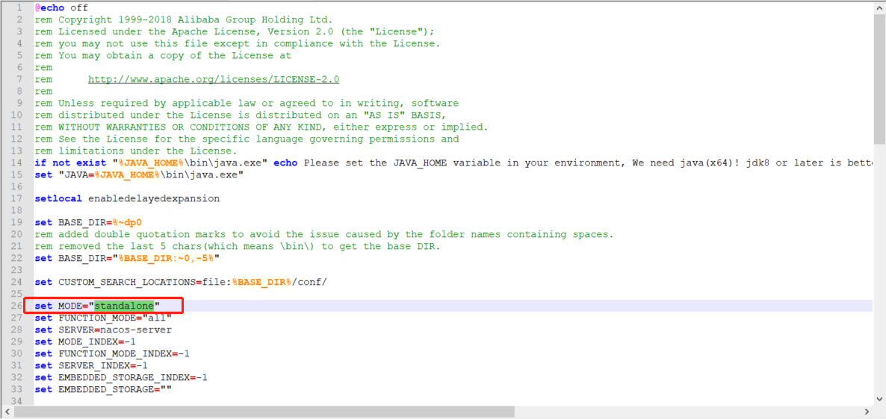
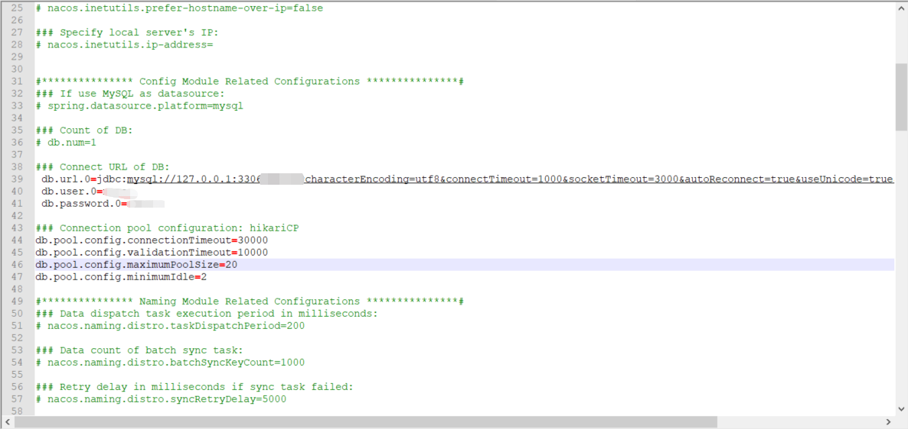
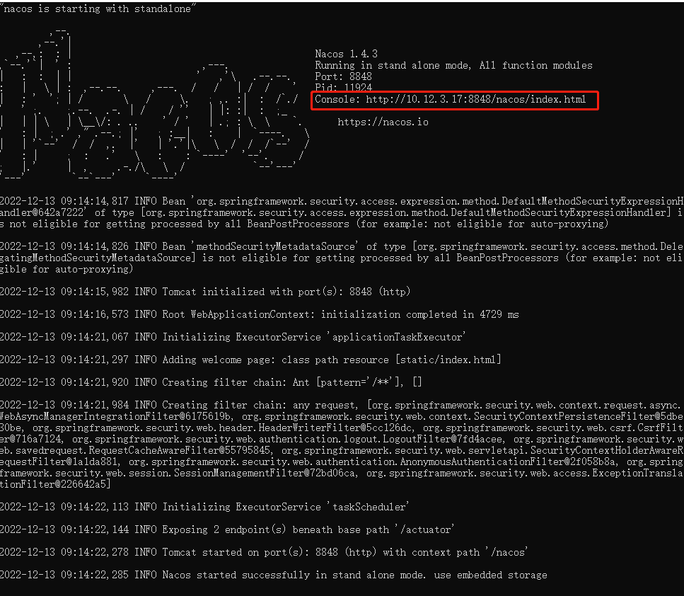
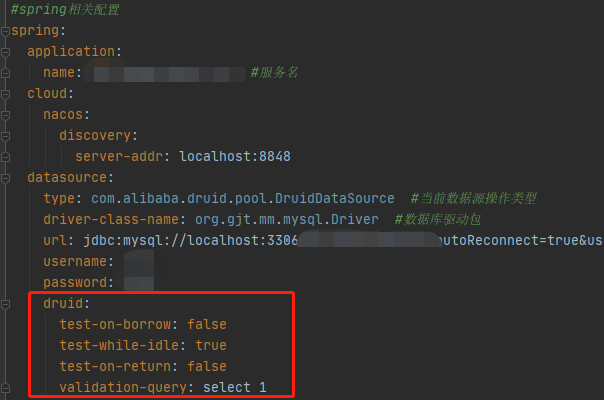
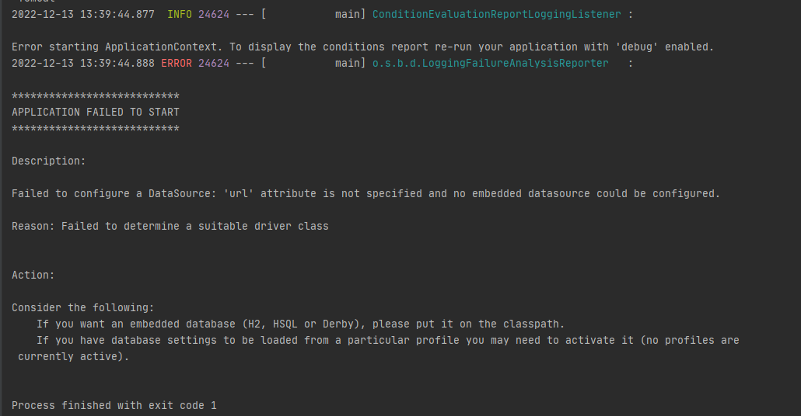

# Alibaba SpringCloud
# 项目搭建
1. 建一个maven父工程  
   父工程用`<dependencyManagement>`管理依赖，用`<properities>`管理版本。
> 参考链接：
> 
> https://blog.csdn.net/m0_67266585/article/details/126553599
> 
> https://blog.csdn.net/weixin_38007185/article/details/123490672?spm=1001.2014.3001.5502

## Nacos 部署
0. Nacos(Name and Config Service),是国产的，是阿里开源的。Nacos负责服务注册与发现，还有分布式配置。可以实现服务注册中心、分布式配置中心。
>nocas官网地址：https://nacos.io/zh-cn/docs/quick-start.html
1. 启动时修改/nacos-server-1.4.3/nacos/bin/startup.cmd代码内容，其中MODE改为standalone，standalone 代表着单机模式运行，非集群模式。


2. 修改/nacos-server-1.4.3/nacos/conf/application.properties中的数据库链接

3. 启动成功后复制链接到浏览器访问，账号密码都是nacos。


**遇到的问题：**
1. 默认最新版本可能与sdk不匹配，降级为1.4.3后启动成功
2. nacos客户端与服务的版本不一致，报错：`com.alibaba.nacos.api.exception.NacosException: Request nacos server failed:`
   >https://blog.csdn.net/chenlengshao/article/details/124649870

3. spring-boot、spring-cloud、spring-cloud-alibaba版本对应参考文档
    >https://www.jianshu.com/p/70fdafbabba4
    >https://www.cnblogs.com/konglxblog/p/16456797.html
4. 报错Exception in thread “main“ java.lang.IllegalArgumentException: Cannot instantiate interface org.spri  
   解决办法：重置maven
5. 报错：com.alibaba.druid.pool.DruidDataSource : testWhileIdle is true, validationQuery not set

    原因：不知道哪里的配置打开了它：`test-while-idle: true` 它打开了`validation-query` 就必须设置

    解决办法：
    application.yml里加入druid的配置
    ```yml
        druid:
            test-on-borrow: false
            test-while-idle: true
            test-on-return: false
            validation-query: select 1
    ```

   

      >https://blog.csdn.net/jx520/article/details/105898539/

6. 报错Invalid bound statement (not found)  
   第二个服务一直报这个错也没解决，后来直接不用xml文件，用MyBatis注释的写法解决了。

7. mybatis使用注解查询获取不到参数，直接写入参数正常。  
   解决办法：#{name}改为${ name}

8. 报错：Error starting ApplicationContext. To display the conditions report re-run your application with 'debug' enabled.
2022-12-13 13:39:44.888 ERROR 24624 --- [           main] o.s.b.d.LoggingFailureAnalysisReporter 


解决办法：

1.加入的依赖没载入，重新reload;

2.去掉`<packaging>pom</packaging>`并重启;