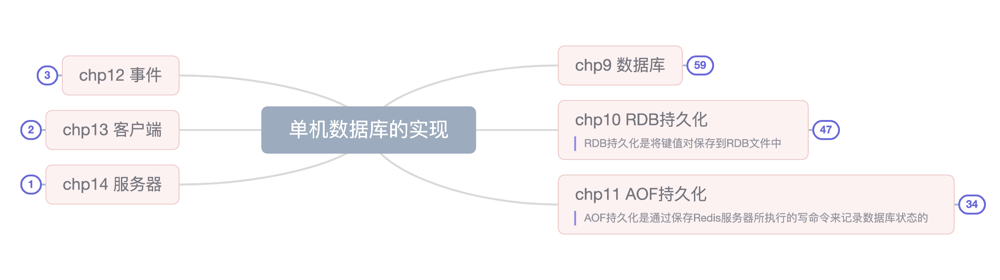
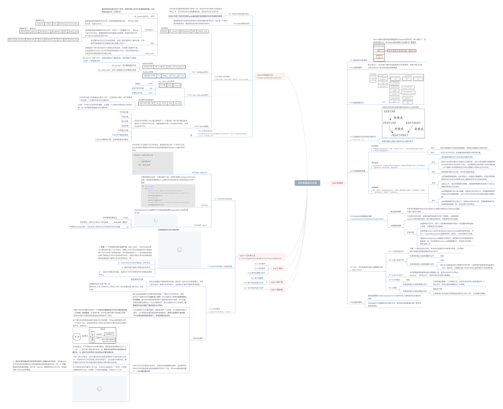

#   Redis笔记

## 《Redis设计与实现》
 > 阅读来源：微信读书

 __思维导图连接:[https://www.mubucm.com/doc/I6SN80Brr8][1]__

 

 

 

 

 

to be continue...

## 小林coding-Redis
>小林coding：[https://xiaolincoding.com/][2]

 __思维导图连接:[https://www.mubucm.com/doc/1Jq6OF82rLo][3]__

 

[1]:https://www.mubucm.com/doc/I6SN80Brr8
[2]:https://xiaolincoding.com/
[3]:https://www.mubucm.com/doc/1Jq6OF82rLo