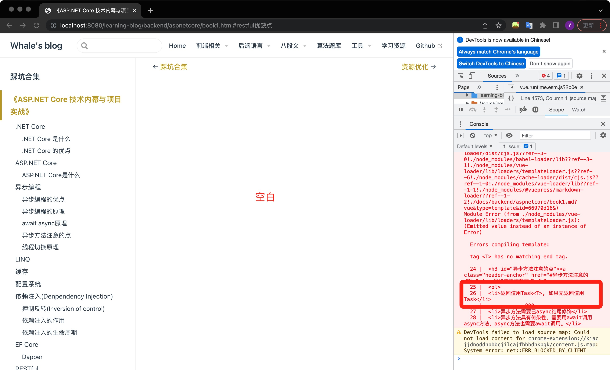

# 一些踩过的坑

## vuepress构建blog如何修改主题色

__安装插件：__

>参考链接：[https://www.vuepress.cn/plugin/official/plugin-blog.html][1]

```sh
yarn add -D @vuepress/plugin-blog
# OR npm install -D @vuepress/plugin-blog
```

__使用：__

```sh
module.exports = {
  plugins: ['@vuepress/blog']
}
```

***

修改`.vuepress/styles/palette.styl`中`$accentColor = #3eaf7c` ，`palette.styl`没有的话就创建一个。

还可以调整其他变量：

``` stylus
// colors
$accentColor = #3eaf7c
$textColor = #2c3e50
$borderColor = #eaecef
$codeBgColor = #282c34
$arrowBgColor = #ccc
$badgeTipColor = #42b983
$badgeWarningColor = darken(#ffe564, 35%)
$badgeErrorColor = #DA5961

// layout
$navbarHeight = 3.6rem
$sidebarWidth = 20rem
$contentWidth = 740px
$homePageWidth = 960px

// responsive breakpoints
$MQNarrow = 959px
$MQMobile = 719px
$MQMobileNarrow = 419px

```

>参考链接：[https://vuepress-theme-blog.billyyyyy3320.com/config/palette.html][2]
***


__修改主题颜色成功。__


## vuepress图片不加载


__解决办法：图片名称改成英文__

如果整个md文件中一个图片的路径错误，整个页面都不显示。


## build报错error Command failed with exit code 1.

> to do

https://blog.csdn.net/m0_54853146/article/details/123345413

原因：npm版本太低

nodejs版本没问题 

nodejs与npm版本对应表：https://nodejs.org/zh-cn/download/releases/

更新npm版本命令：

指定版本 `npm -g install npm@8.15.0`  
不指定版本 `npm -g install npm`

再去检查发现版本还是没升上去

node安装改路径：https://blog.csdn.net/wuyifei724277441/article/details/125669049

***

Unhandled rejection Error: EPERM: operation not permitted, mkdir ‘C:\Program Files\nodejs\node_cache

参考：https://blog.csdn.net/YaRuu/article/details/125559613


You are likely using a version of node-tar or npm that is incompatible with this version of Node.js.

说明node和npm版本不匹配

卸载后把有关npm的文件全部删除，再重新安装，npm版本升级成功

发现yarn命令不好用了

https://blog.csdn.net/dd602350527/article/details/106694371?spm=1001.2101.3001.6650.5&utm_medium=distribute.pc_relevant.none-task-blog-2%7Edefault%7EOPENSEARCH%7ERate-5-106694371-blog-89465508.pc_relevant_multi_platform_whitelistv4&depth_1-utm_source=distribute.pc_relevant.none-task-blog-2%7Edefault%7EOPENSEARCH%7ERate-5-106694371-blog-89465508.pc_relevant_multi_platform_whitelistv4&utm_relevant_index=6

`npm install -g cnpm --registry=https://registry.npm.taobao.org `

https://cloud.tencent.com/developer/article/1905294

重安node影响yarn了，需要重新安装
`npm install -g yarn `

yarn : 无法加载文件 E:\nodejs\node_global\yarn.ps1，因为在此系统上禁止运行脚本。有关详细信息，请参阅 https:/go.microsoft.com/fwlink/?LinkID=135170 中的 about_Execution_Policies。
所在位置 行:1 字符: 1

https://blog.csdn.net/jianghuafeng0/article/details/123105044

解决了

## 本地dev是本地只展示了目录，正文空白

打开f12调试后发现报错内容



查看代码后发现罪魁祸首：


```
Task<T>
```

可能是和markdown语法有冲突，所以把这段作为行内代码引起来。


[1]:https://www.vuepress.cn/plugin/official/plugin-blog.html
[2]:https://vuepress-theme-blog.billyyyyy3320.com/config/palette.html