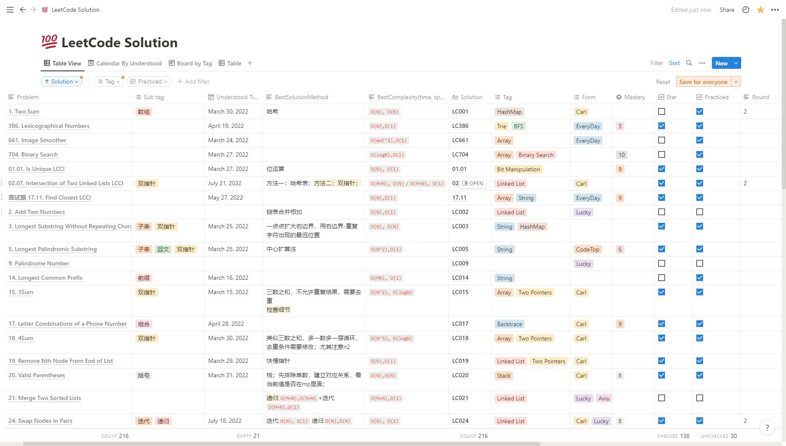
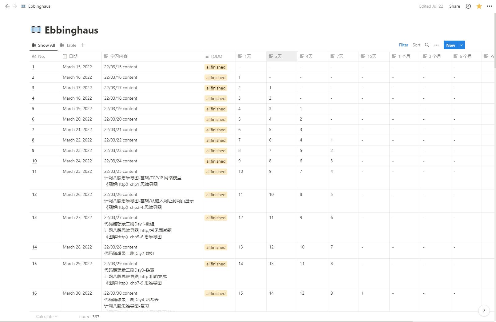
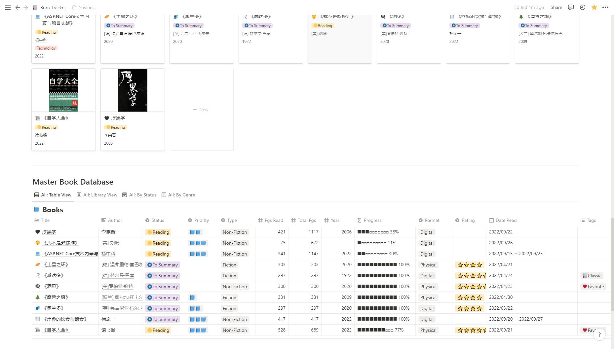
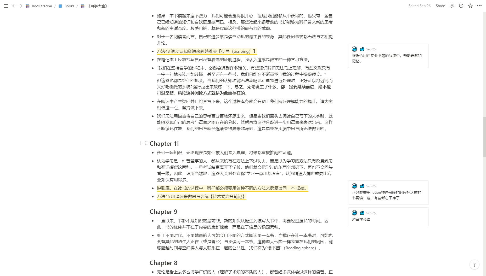
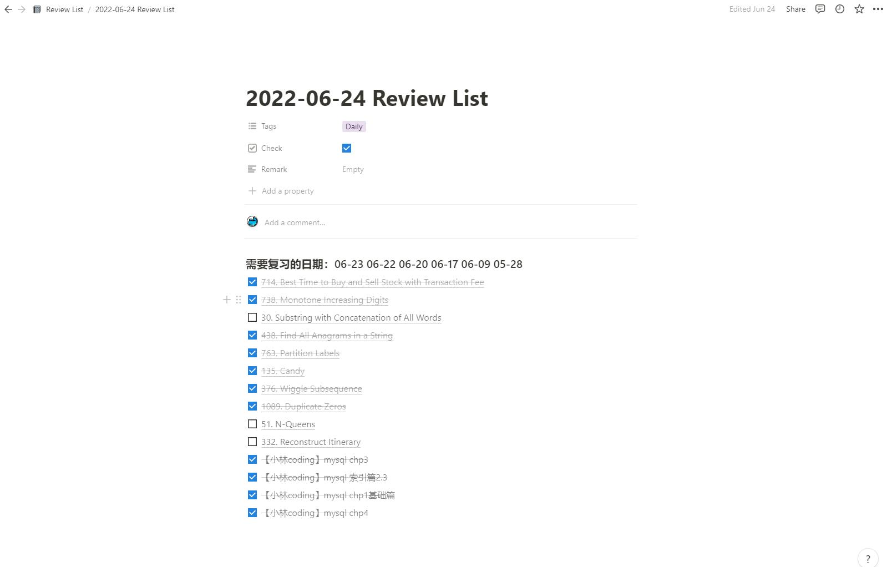
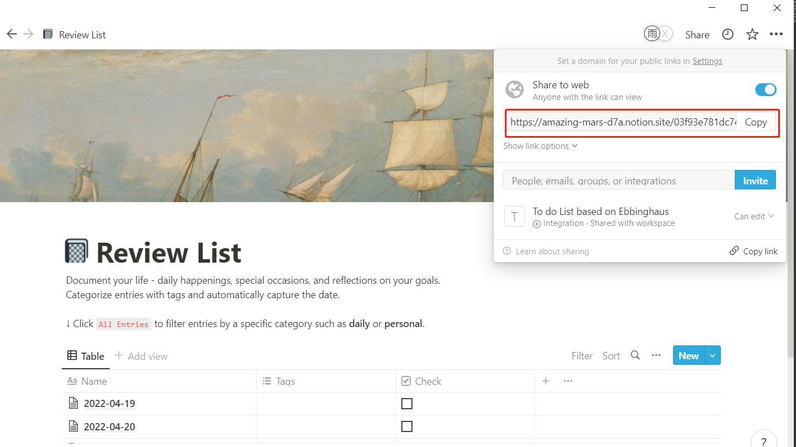
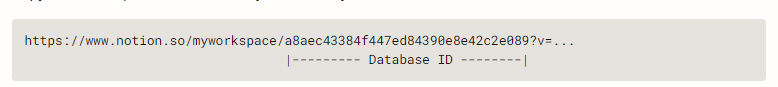
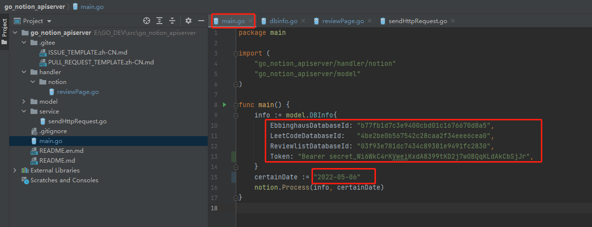
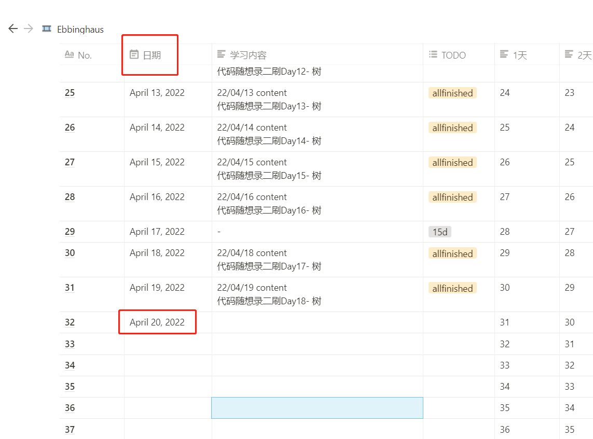

# Notion

## Notion是什么
> A unified & collaborative workspace for your notes, wikis, and tasks. 将笔记、知识库和任务管理无缝整合的协作平台

 

参考链接：[Notion，一款强大到改变我人生的软件][zhihu]
***
## Notion模板推荐

### 1. LeetCode刷题模板
模板链接🔗：[LeetCode Solution][LeetCode]

 

***
### 2. 艾宾浩斯遗忘曲线模板
模板链接🔗：[Ebbinghaus][Ebbinghaus]

 

***

### 3. ReviewList模板
模板链接🔗：[ReviewList][ReviewList]

 

***
### 4. Book Tracker
链接🔗：(付费模板)[booktracker][booktracker]

 

 

 

***
## 如何根据Ebbinghaus生成需要复习的题目

**参考链接：**

Notion Api官方文档：[https://developers.notion.com/][api]

项目源码链接：[https://gitee.com/jingyushan33/go_notion_apiserver.git][code]（Go语言实现）

参数调试文档：[https://note.youdao.com/ynoteshare/index.html?id=d648fab03181626be7857fd430de36bb&type=note&_time=1652932178453][docs]

***
### 0、复习清单效果展示

***

### 一、示例模板链接

链接🔗：[Ebbinghaus][Ebbinghaus]

链接🔗：[LeetCode][LeetCode]

链接🔗：[ReviewList][ReviewList]

***
### 二、获取token和三个notion数据库的id

#### 1. 参考官方网站创建自己的integration，获取token

[https://developers.notion.com/docs/getting-started][standard_gettoken]

#### 2. 获取三个数据库的id

打开前面提供的示例模板中的链接，点击右上角**Duplicate**，复制到自己的notion里。

在自己的notion里找到已经复制下来的模板，点击右上角**Share**可以看到分享链接。

Copy分享链接,链接中如下图所示的这一段id为当前Database ID

### 三、启动

**只需要填入Database ID、token和指定时间**

### 四、注意事项

**1. 确定指定日期已经在日期列上**

**2. Ebbinghaus的列名不能动**

**3. LeetCode Solution**
**以下列名不能动：**
Problem的字段如果不带链接不确定有没有问题；
Star代表需要复习的字段；
UnderStood Time根据这个时间进行复习；

***
[zhihu]:https://zhuanlan.zhihu.com/p/268991624

[Ebbinghaus]:https://amazing-mars-d7a.notion.site/b77fb1d7c3e9400cbd01c1676670d8a5?v=ad489206074c4abf9fd2638c01de886a

[LeetCode]:https://amazing-mars-d7a.notion.site/4be2be0b567542c28caa2f34eee6cea0?v=3c49767a937641fcbbdece72bed58625

[ReviewList]:https://amazing-mars-d7a.notion.site/03f93e781dc7434c89381e9491fc2830?v=412dd12175f8467484cc7d4bad9e002c

[booktracker]:https://amazing-mars-d7a.notion.site/Book-tracker-54e835ce6aa94625b7d47b324282afde

[api]:[https://developers.notion.com/]

[code]:[https://gitee.com/jingyushan33/go_notion_apiserver.git]

[docs]:[https://note.youdao.com/ynoteshare/index.html?id=d648fab03181626be7857fd430de36bb&type=note&_time=1652932178453]

[standard_gettoken]:[https://developers.notion.com/docs/getting-started]